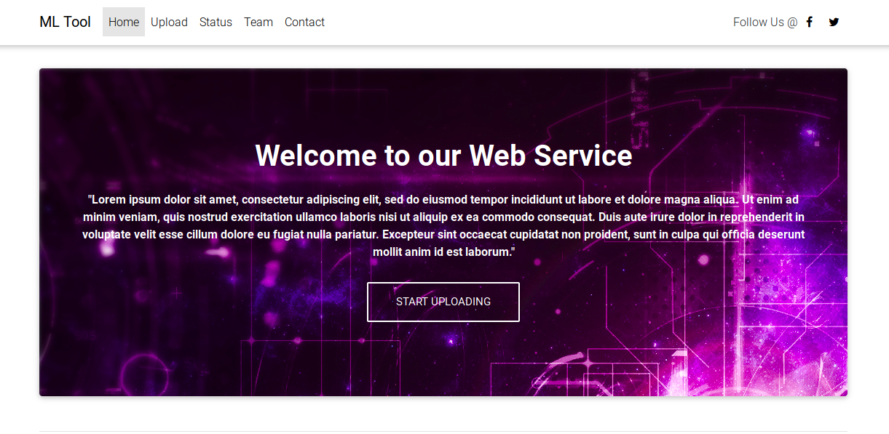
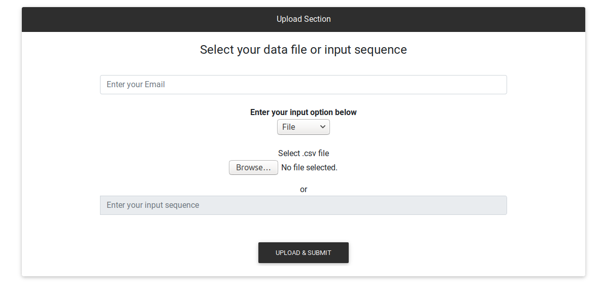
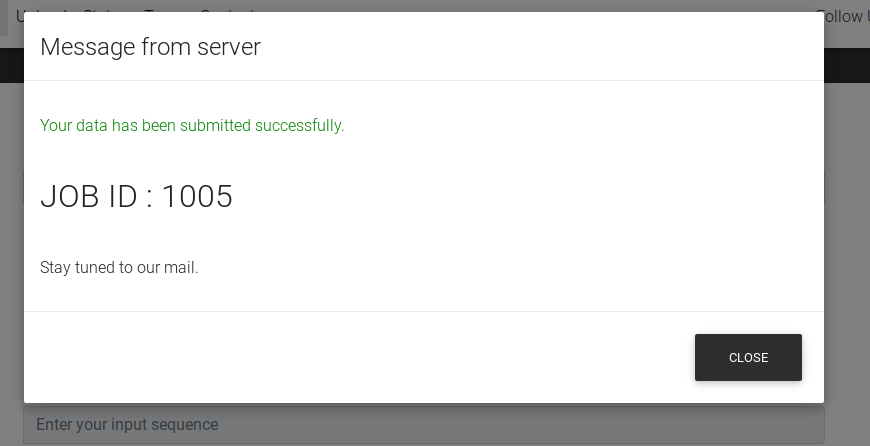
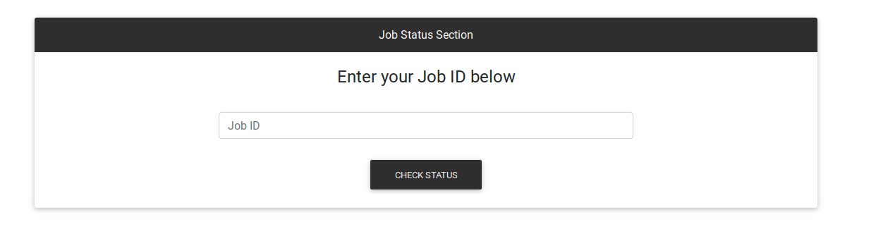
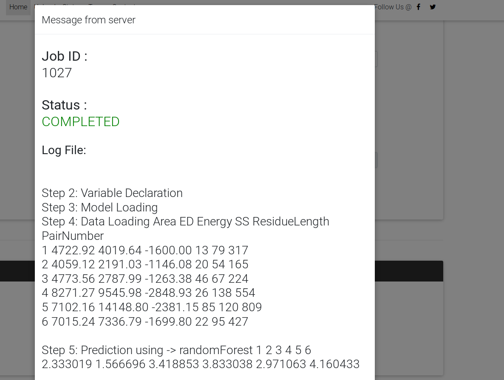
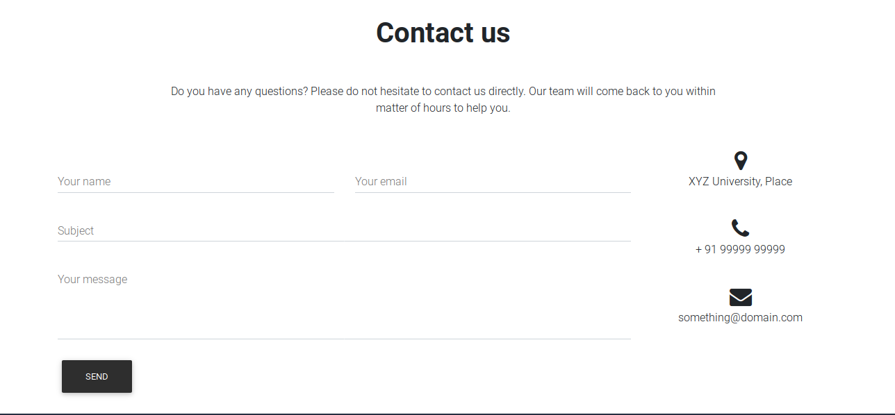

# `Boiler Plate for developing ML Web App`

This Django app was originally developed for MLTool.in website. I have altered some of the code, so that it can be used as a boiler plate for other Machine Learning web apps. You can readily implement this app for any of your projects.

## Prerequisite
  * Make sure python 3.6 is installed.
  * Install R >= 3.4 `sudo apt-get install r-base`.

## Initial setup
  * Clone repository `git clone https://github.com/MexsonFernandes/MLTool-BoilerPlate-DjangoWebApp`.
  * `cd MLTool-BoilerPlate-DjangoWebApp`
  * Install required dependencies.
    * run `pip3 install -r requirements.txt`.
  * Add your email id and password in project/settings.py file.
    * EMAIL_HOST_USER = 'something@gmail.com'
    * EMAIL_HOST_PASSWORD = 'XXXXXXX'
  * Database
    * run `python3 manage.py makemigrations`
    * run `python3 manage.py migrate`

## Run web app
  * `python3 manage.py runserver`
  * Head over to http://localhost:8000/
  
## Model files and prediction scripts
  * Copy the model files in media/modelData
  * Edit the mainFile.py and mainSequence.py to run your python or R scripts.
  * Important arguments passed to main*.py files.
    * working_dir - place where model files and scripts exist.
    * file_path - path of file submitted by user.
    * result_path - path where end results needs to be saved.
  * Log is saved in result_path with 'log.txt' name.
  * Result file name should be 'predict_select.csv'.

Note: 
  * 'log.txt' contains the information generated during thread runtime.
  * 'predict_select.csv' and 'log.txt' are mailed to the user.

## Screenshots

## License

The MIT License (MIT)

Copyright (c) 2019 Mexson Fernandes

Permission is hereby granted, free of charge, to any person obtaining a copy of
this software and associated documentation files (the "Software"), to deal in
the Software without restriction, including without limitation the rights to
use, copy, modify, merge, publish, distribute, sublicense, and/or sell copies
of the Software, and to permit persons to whom the Software is furnished to do
so, subject to the following conditions:

The above copyright notice and this permission notice shall be included in all
copies or substantial portions of the Software.

THE SOFTWARE IS PROVIDED "AS IS", WITHOUT WARRANTY OF ANY KIND, EXPRESS OR
IMPLIED, INCLUDING BUT NOT LIMITED TO THE WARRANTIES OF MERCHANTABILITY,
FITNESS FOR A PARTICULAR PURPOSE AND NONINFRINGEMENT. IN NO EVENT SHALL THE
AUTHORS OR COPYRIGHT HOLDERS BE LIABLE FOR ANY CLAIM, DAMAGES OR OTHER
LIABILITY, WHETHER IN AN ACTION OF CONTRACT, TORT OR OTHERWISE, ARISING FROM,
OUT OF OR IN CONNECTION WITH THE SOFTWARE OR THE USE OR OTHER DEALINGS IN THE
SOFTWARE.
